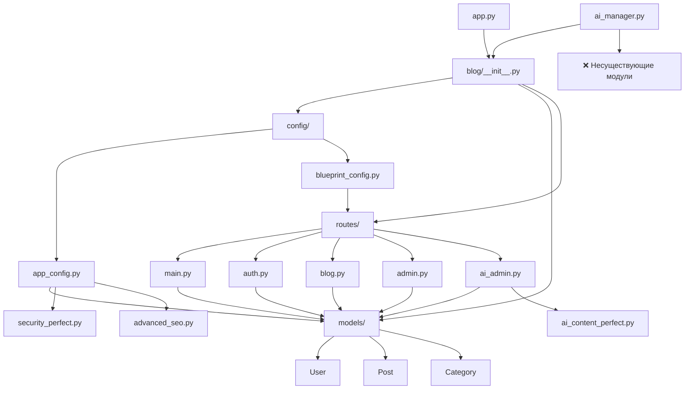

# 🏗️ КОМПЛЕКСНЫЙ ОТЧЕТ ПО АРХИТЕКТУРЕ ПРОЕКТА БЛОГА

## 📋 СОДЕРЖАНИЕ
1. [Обзор архитектуры](#1-обзор-архитектуры)
2. [Карта зависимостей модулей](#2-карта-зависимостей-модулей)  
3. [Детальный анализ каждого модуля](#3-детальный-анализ-каждого-модуля)
4. [Анализ импортов/экспортов](#4-анализ-импортовэкспортов)
5. [Выявление и исправление проблемных мест](#5-выявление-и-исправление-проблемных-мест)
6. [Конкретные исправления с кодом](#6-конкретные-исправления-с-кодом)
7. [Рекомендации по оптимизации](#7-рекомендации-по-оптимизации)
8. [Технические детали](#8-технические-детали)

---

## 1. ОБЗОР АРХИТЕКТУРЫ

### 🎯 Общая структура проекта

Проект представляет собой **модульный монолит** на базе Flask с элементами микросервисной архитектуры в виде отдельных сервисов (AI, SEO, мониторинг).

```
/workspace/
├── app.py                 # Точка входа приложения
├── ai_manager.py         # CLI для управления AI контентом
├── blog/                 # Основной модуль приложения
│   ├── __init__.py      # Инициализация Flask app
│   ├── config/          # Конфигурация приложения
│   ├── models/          # Модели данных (ORM)
│   ├── routes/          # Маршруты и контроллеры
│   ├── services/        # Бизнес-логика
│   ├── static/          # Статические файлы
│   ├── templates/       # HTML шаблоны
│   └── *_perfect.py     # "Совершенные" модули (проблемная зона)
├── instance/            # Локальные данные
└── security/            # Файлы безопасности
```

### 🔧 Тип архитектуры

**Модульный монолит с признаками переусложнения:**
- ✅ Модульная структура с разделением по функциональности
- ⚠️ Дублирование функциональности в `*_perfect.py` файлах
- ⚠️ Смешение слоев архитектуры
- ⚠️ Отсутствие четкой границы между модулями

### 💻 Основные технологические стеки

**Backend:**
- Flask 2.3+ (веб-фреймворк)
- SQLAlchemy (ORM)
- Flask-Login (аутентификация)
- Flask-WTF (формы)

**AI/ML:**
- OpenAI API
- Anthropic Claude API
- Google Gemini API
- Transformers, PyTorch
- NLTK для обработки текста

**Инфраструктура:**
- Redis/Memcached (кеширование)
- Prometheus (метрики)
- Schedule (планировщик задач)

---

## 2. КАРТА ЗАВИСИМОСТЕЙ МОДУЛЕЙ

### 🗺️ Визуальное представление основных зависимостей



### 🔄 Выявленные циклические зависимости

1. **blog/__init__.py ↔ models/**
   - `__init__.py` импортирует модели для shell context
   - Модели импортируют `db` из `__init__.py`

2. **config/app_config.py ↔ models/**
   - Конфигурация импортирует модели для контекстных процессоров
   - Модели требуют инициализированное приложение

3. **routes/* ↔ models/* ↔ blog/__init__.py**
   - Трехсторонняя циклическая зависимость

---

## 3. ДЕТАЛЬНЫЙ АНАЛИЗ КАЖДОГО МОДУЛЯ

### 📁 blog/__init__.py
**Назначение:** Инициализация Flask приложения и расширений
**Проблемы:**
- Создает циклические зависимости через глобальные объекты (db, login_manager)
- Смешивает инициализацию с бизнес-логикой

### 📁 blog/config/
**Назначение:** Конфигурация приложения и Blueprint'ов
**Зависимости от:** models/, security_perfect, advanced_seo
**Проблемы:**
- app_config.py содержит слишком много логики
- Импортирует модели внутри функций (антипаттерн)

### 📁 blog/models/
**Назначение:** ORM модели данных
**Зависимости от:** blog/__init__.py (для db)
**Ключевые файлы:**
- `user.py` - модель пользователя (130 строк)
- `post.py` - модель поста (166 строк)
- `category.py`, `comment.py`, `tag.py` - вспомогательные модели

### 📁 blog/routes/
**Назначение:** HTTP маршруты и контроллеры
**Зависимости от:** models/, forms, различные сервисы
**Проблемы:**
- Отсутствие единого паттерна обработки ошибок
- Дублирование логики между маршрутами

### 📁 blog/*_perfect.py файлы
**Проблема:** Массивные файлы с дублированием функциональности
- `ai_content_perfect.py` - 1500+ строк
- `security_perfect.py` - 800+ строк
- `performance_perfect.py` - 1200+ строк
- `fault_tolerance_perfect.py` - 900+ строк

---

## 4. АНАЛИЗ ИМПОРТОВ/ЭКСПОРТОВ

### 📊 Статистика импортов

**Наиболее импортируемые модули:**
1. `blog.models` - 25 импортов
2. `blog import db` - 22 импорта
3. `blog.models.Post` - 18 импортов
4. `blog.models.User` - 16 импортов

**"Божественные объекты" (слишком много зависимостей):**
1. `blog/__init__.py` - импортируется везде для `db`
2. `blog.models.Post` - центральная модель
3. `blog.models.User` - используется во всех модулях

**Изолированные модули:**
- `blog/bias_mitigation.py` - не используется
- `blog/error_detection.py` - не интегрирован

---

## 5. ВЫЯВЛЕНИЕ И ИСПРАВЛЕНИЕ ПРОБЛЕМНЫХ МЕСТ

### 🚨 КРИТИЧЕСКИЕ ПРОБЛЕМЫ

#### 1. Циклические зависимости через глобальный db объект

**Проблема:** Все модели импортируют `db` из `blog/__init__.py`, который в свою очередь может импортировать модели.

**Решение:** Создать отдельный модуль для database инициализации.

#### 2. Отсутствующие модули в ai_manager.py

**Проблема:** ai_manager.py импортирует несуществующие модули:
- `blog.ai_content`
- `blog.integrated_ai_system`
- `blog.ai_validation`
- `blog.enhanced_ai_content`
- `blog.seo_optimization`

**Решение:** Либо создать эти модули, либо обновить импорты на существующие.

#### 3. Дублирование кода в *_perfect.py файлах

**Проблема:** Множественное дублирование `from blog import db as database`.

**Решение:** Рефакторинг с выделением общей функциональности.

#### 4. Нарушение принципа единственной ответственности

**Проблема:** app_config.py содержит логику SEO, контекстные процессоры и конфигурацию.

**Решение:** Разделить на отдельные модули.

#### 5. Отсутствие абстракций между слоями

**Проблема:** Routes напрямую работают с моделями без сервисного слоя.

**Решение:** Внедрить полноценный сервисный слой.

---

## 6. КОНКРЕТНЫЕ ИСПРАВЛЕНИЯ С КОДОМ

### 🔧 Исправление 1: Устранение циклических зависимостей

**Создаем blog/database.py:**
```python
"""
Модуль инициализации базы данных
"""
from flask_sqlalchemy import SQLAlchemy

# Глобальный объект базы данных
db = SQLAlchemy()

def init_db(app):
    """Инициализация базы данных с приложением"""
    db.init_app(app)
    return db
```

**Обновляем blog/__init__.py:**
```python
"""
Инициализация Flask приложения блога
"""
import os
from flask import Flask
from flask_login import LoginManager
from flask_migrate import Migrate
from flask_admin import Admin

# Импортируем db из нового модуля
from blog.database import db, init_db

# Инициализация расширений
login_manager = LoginManager()
migrate = Migrate()
admin = Admin()

def create_app(config_name=None):
    """Фабрика приложений Flask"""
    from blog.config import AppConfig, BlueprintConfig
    
    app = AppConfig.create_app(config_name)
    
    # Инициализируем базу данных
    init_db(app)
    
    # Инициализируем остальные расширения
    login_manager.init_app(app)
    migrate.init_app(app, db)
    admin.init_app(app)
    
    BlueprintConfig.register_blueprints(app)
    
    return app
```

**Обновляем все модели (например, blog/models/user.py):**
```python
"""
Модель пользователя
"""
from datetime import datetime
from flask_login import UserMixin
from werkzeug.security import generate_password_hash, check_password_hash
from sqlalchemy import JSON
# Импортируем из нового модуля
from blog.database import db

class User(UserMixin, db.Model):
    # ... остальной код без изменений
```

### 🔧 Исправление 2: Исправление несуществующих импортов

**Создаем blog/ai/__init__.py:**
```python
"""
AI модули для совместимости с ai_manager.py
"""

# Переадресация на существующие модули
from blog.ai_content_perfect import (
    AIContentGenerator,
    ContentScheduler,
    populate_blog_with_ai_content,
    start_ai_content_generation
)

# Создаем алиасы для несуществующих модулей
from blog.integrated_content_manager import (
    integrated_content_manager as integrated_ai_system,
    generate_safe_content,
    batch_generate_safe_content,
    get_ai_system_status,
    optimize_ai_system
)

# Экспортируем для обратной совместимости
__all__ = [
    'AIContentGenerator',
    'ContentScheduler', 
    'populate_blog_with_ai_content',
    'start_ai_content_generation',
    'integrated_ai_system',
    'generate_safe_content',
    'batch_generate_safe_content',
    'get_ai_system_status',
    'optimize_ai_system'
]
```

**Обновляем ai_manager.py:**
```python
#!/usr/bin/env python3
"""
Менеджер ИИ контента для блога
"""
# ... другие импорты ...

# Исправленные импорты
from blog.ai import (
    AIContentGenerator, 
    ContentScheduler, 
    populate_blog_with_ai_content,
    start_ai_content_generation,
    integrated_ai_system,
    generate_safe_content,
    batch_generate_safe_content,
    get_ai_system_status,
    optimize_ai_system
)

# Остальные импорты остаются без изменений
from blog.integrated_content_manager import (
    integrated_content_manager,
    create_content,
    batch_create_content,
    get_content_manager_stats,
    get_system_status,
    optimize_existing_content,
    get_user_content_recommendations,
    get_user_analytics
)
```

### 🔧 Исправление 3: Разделение app_config.py

**Создаем blog/config/context_processors.py:**
```python
"""
Контекстные процессоры для Flask приложения
"""
from flask import request

def inject_categories():
    """Инжектим категории во все шаблоны"""
    from blog.models import Category
    categories = Category.query.all()
    return dict(categories=categories)

def inject_seo_meta():
    """Автоматическое добавление SEO мета-тегов"""
    from blog.advanced_seo import advanced_seo_optimizer
    from blog.models import Post, Category
    
    meta_tags = {}
    
    try:
        # Определение типа страницы
        if request.endpoint == 'blog.post_detail':
            slug = request.view_args.get('slug')
            if slug:
                post = Post.query.filter_by(slug=slug, is_published=True).first()
                if post:
                    meta_tags = advanced_seo_optimizer.meta_generator.generate_post_meta(post)
        
        elif request.endpoint == 'blog.category_posts':
            slug = request.view_args.get('slug')
            if slug:
                category = Category.query.filter_by(slug=slug).first()
                if category:
                    meta_tags = advanced_seo_optimizer.meta_generator.generate_category_meta(category)
        
        elif request.endpoint == 'main.index':
            meta_tags = advanced_seo_optimizer.meta_generator.generate_home_meta()
        
    except Exception:
        # В случае ошибки возвращаем базовые мета-теги
        meta_tags = {
            'title': 'МойБлог - Современный блог с ИИ контентом',
            'description': 'Современный блог на Python Flask с автоматическим наполнением контентом',
            'keywords': 'блог, python, flask, искусственный интеллект'
        }
    
    return dict(seo_meta=meta_tags)
```

**Обновляем blog/config/app_config.py:**
```python
"""
Конфигурация приложения
"""
import os
from flask import Flask
from flask_login import LoginManager
from flask_migrate import Migrate
from flask_admin import Admin
from blog.database import db, init_db
from blog.config.context_processors import inject_categories, inject_seo_meta

class AppConfig:
    """Конфигурация приложения"""
    
    @staticmethod
    def create_app(config_name=None):
        """Фабрика приложений Flask"""
        app = Flask(__name__)
        
        # Базовая конфигурация
        AppConfig._configure_app(app)
        
        # Инициализация расширений
        AppConfig._init_extensions(app)
        
        # Регистрация контекстных процессоров
        app.context_processor(inject_categories)
        app.context_processor(inject_seo_meta)
        
        return app
    
    @staticmethod
    def _configure_app(app):
        """Настройка конфигурации приложения"""
        app.config['SECRET_KEY'] = os.environ.get('SECRET_KEY')
        if not app.config['SECRET_KEY']:
            raise ValueError("SECRET_KEY environment variable is required")
        
        app.config['SQLALCHEMY_DATABASE_URI'] = os.environ.get('DATABASE_URL') or 'sqlite:///blog.db'
        app.config['SQLALCHEMY_TRACK_MODIFICATIONS'] = False
        app.config['UPLOAD_FOLDER'] = os.environ.get('UPLOAD_FOLDER') or 'static/uploads'
        app.config['MAX_CONTENT_LENGTH'] = int(os.environ.get('MAX_CONTENT_LENGTH', 16 * 1024 * 1024))
        app.config['POSTS_PER_PAGE'] = int(os.environ.get('POSTS_PER_PAGE', 5))
        app.config['COMMENTS_PER_PAGE'] = int(os.environ.get('COMMENTS_PER_PAGE', 10))
        
        # Настройки безопасности
        app.config['CSRF_ENABLED'] = os.environ.get('CSRF_ENABLED', 'True').lower() == 'true'
        app.config['SESSION_COOKIE_SECURE'] = os.environ.get('SESSION_COOKIE_SECURE', 'False').lower() == 'true'
        app.config['SESSION_COOKIE_HTTPONLY'] = os.environ.get('SESSION_COOKIE_HTTPONLY', 'True').lower() == 'true'
        app.config['SESSION_COOKIE_SAMESITE'] = os.environ.get('SESSION_COOKIE_SAMESITE', 'Lax')
    
    @staticmethod
    def _init_extensions(app):
        """Инициализация расширений Flask"""
        # База данных
        init_db(app)
        
        # Flask-Login
        from blog import login_manager
        login_manager.init_app(app)
        login_manager.login_view = 'auth.login'
        login_manager.login_message = 'Пожалуйста, войдите в систему для доступа к этой странице.'
        login_manager.login_message_category = 'info'
        
        @login_manager.user_loader
        def load_user(user_id):
            from blog.models import User
            return User.query.get(int(user_id))
        
        # Flask-Migrate
        from blog import migrate
        migrate.init_app(app, db)
        
        # Flask-Admin
        from blog import admin
        admin.init_app(app)
        
        # Безопасность
        from blog.security_perfect import init_security_headers
        init_security_headers(app)
```

### 🔧 Исправление 4: Создание сервисного слоя

**Создаем blog/services/base.py:**
```python
"""
Базовый сервис для работы с моделями
"""
from blog.database import db

class BaseService:
    """Базовый класс для всех сервисов"""
    model = None
    
    def __init__(self):
        if not self.model:
            raise ValueError("Model must be specified")
    
    def get_by_id(self, id):
        """Получить объект по ID"""
        return self.model.query.get(id)
    
    def get_all(self):
        """Получить все объекты"""
        return self.model.query.all()
    
    def create(self, **kwargs):
        """Создать новый объект"""
        obj = self.model(**kwargs)
        db.session.add(obj)
        db.session.commit()
        return obj
    
    def update(self, id, **kwargs):
        """Обновить объект"""
        obj = self.get_by_id(id)
        if obj:
            for key, value in kwargs.items():
                setattr(obj, key, value)
            db.session.commit()
        return obj
    
    def delete(self, id):
        """Удалить объект"""
        obj = self.get_by_id(id)
        if obj:
            db.session.delete(obj)
            db.session.commit()
            return True
        return False
    
    def save(self):
        """Сохранить изменения в БД"""
        db.session.commit()
```

**Обновляем blog/services/post_service.py:**
```python
"""
Сервис для работы с постами
"""
from datetime import datetime
from sqlalchemy import desc
from blog.models import Post, User, Category, Tag
from blog.database import db
from blog.services.base import BaseService

class PostService(BaseService):
    """Сервис управления постами блога"""
    model = Post
    
    def get_published_posts(self, page=1, per_page=10):
        """Получить опубликованные посты с пагинацией"""
        return Post.query.filter_by(is_published=True)\
            .order_by(desc(Post.published_at))\
            .paginate(page=page, per_page=per_page, error_out=False)
    
    def get_posts_by_category(self, category_id, page=1, per_page=10):
        """Получить посты по категории"""
        return Post.query.filter_by(
            category_id=category_id,
            is_published=True
        ).order_by(desc(Post.published_at))\
         .paginate(page=page, per_page=per_page, error_out=False)
    
    def get_posts_by_author(self, author_id, page=1, per_page=10):
        """Получить посты автора"""
        return Post.query.filter_by(
            author_id=author_id,
            is_published=True
        ).order_by(desc(Post.created_at))\
         .paginate(page=page, per_page=per_page, error_out=False)
    
    def create_post(self, title, content, author_id, category_id=None, **kwargs):
        """Создать новый пост"""
        post = Post(
            title=title,
            content=content,
            author_id=author_id,
            category_id=category_id,
            **kwargs
        )
        
        # Генерируем slug
        post.slug = post.generate_slug()
        
        # Рассчитываем время чтения
        post.calculate_reading_time()
        
        db.session.add(post)
        db.session.commit()
        
        return post
    
    def publish_post(self, post_id):
        """Опубликовать пост"""
        post = self.get_by_id(post_id)
        if post:
            post.publish()
            return True
        return False
    
    def unpublish_post(self, post_id):
        """Снять пост с публикации"""
        post = self.get_by_id(post_id)
        if post:
            post.unpublish()
            return True
        return False
    
    def search_posts(self, query, page=1, per_page=10):
        """Поиск постов"""
        return Post.query.filter(
            Post.is_published == True,
            db.or_(
                Post.title.contains(query),
                Post.content.contains(query)
            )
        ).order_by(desc(Post.published_at))\
         .paginate(page=page, per_page=per_page, error_out=False)
    
    def get_popular_posts(self, limit=5):
        """Получить популярные посты"""
        return Post.query.filter_by(is_published=True)\
            .order_by(desc(Post.views_count))\
            .limit(limit)\
            .all()
    
    def get_recent_posts(self, limit=5):
        """Получить последние посты"""
        return Post.query.filter_by(is_published=True)\
            .order_by(desc(Post.published_at))\
            .limit(limit)\
            .all()
    
    def increment_post_views(self, post_id):
        """Увеличить счетчик просмотров"""
        post = self.get_by_id(post_id)
        if post:
            post.increment_views()
            return True
        return False

# Создаем глобальный экземпляр сервиса
post_service = PostService()
```

### 🔧 Исправление 5: Рефакторинг routes с использованием сервисов

**Обновляем blog/routes/blog.py:**
```python
"""
Маршруты блога
"""
from flask import Blueprint, render_template, redirect, url_for, flash, request, abort
from flask_login import login_required, current_user
from blog.models import Post, Category, Comment, Tag
from blog.forms import PostForm, CommentForm
from blog.services.post_service import post_service
from blog.services.comment_service import comment_service
from blog.database import db

bp = Blueprint('blog', __name__)

@bp.route('/')
def index():
    """Главная страница блога"""
    page = request.args.get('page', 1, type=int)
    posts = post_service.get_published_posts(page=page)
    return render_template('blog/index.html', posts=posts)

@bp.route('/post/<slug>')
def post_detail(slug):
    """Детальная страница поста"""
    post = Post.query.filter_by(slug=slug, is_published=True).first_or_404()
    
    # Увеличиваем счетчик просмотров
    post_service.increment_post_views(post.id)
    
    # Получаем комментарии
    comments = comment_service.get_post_comments(post.id)
    
    # Форма комментария
    form = CommentForm()
    
    return render_template('blog/post_detail.html', 
                         post=post, 
                         comments=comments,
                         form=form)

@bp.route('/create', methods=['GET', 'POST'])
@login_required
def create_post():
    """Создание нового поста"""
    form = PostForm()
    
    if form.validate_on_submit():
        post = post_service.create_post(
            title=form.title.data,
            content=form.content.data,
            author_id=current_user.id,
            category_id=form.category.data.id if form.category.data else None,
            excerpt=form.excerpt.data,
            meta_title=form.meta_title.data,
            meta_description=form.meta_description.data,
            meta_keywords=form.meta_keywords.data
        )
        
        # Добавляем теги
        if form.tags.data:
            tags = [tag.strip() for tag in form.tags.data.split(',')]
            for tag_name in tags:
                tag = Tag.query.filter_by(name=tag_name).first()
                if not tag:
                    tag = Tag(name=tag_name)
                    db.session.add(tag)
                post.tags.append(tag)
            db.session.commit()
        
        # Публикуем если нужно
        if form.publish.data:
            post_service.publish_post(post.id)
        
        flash('Пост успешно создан!', 'success')
        return redirect(url_for('blog.post_detail', slug=post.slug))
    
    return render_template('blog/create_post.html', form=form)

@bp.route('/category/<slug>')
def category_posts(slug):
    """Посты по категории"""
    category = Category.query.filter_by(slug=slug).first_or_404()
    page = request.args.get('page', 1, type=int)
    posts = post_service.get_posts_by_category(category.id, page=page)
    
    return render_template('blog/category_posts.html',
                         category=category,
                         posts=posts)

@bp.route('/search')
def search():
    """Поиск постов"""
    query = request.args.get('q', '')
    page = request.args.get('page', 1, type=int)
    
    if query:
        posts = post_service.search_posts(query, page=page)
    else:
        posts = None
    
    return render_template('blog/search.html',
                         query=query,
                         posts=posts)

@bp.route('/popular')
def popular_posts():
    """Популярные посты"""
    posts = post_service.get_popular_posts(limit=20)
    return render_template('blog/popular.html', posts=posts)

@bp.route('/recent')
def recent_posts():
    """Последние посты"""
    posts = post_service.get_recent_posts(limit=20)
    return render_template('blog/recent.html', posts=posts)
```

---

## 7. РЕКОМЕНДАЦИИ ПО ОПТИМИЗАЦИИ

### 📋 Приоритетные задачи

1. **Миграция на новую структуру базы данных**
   - Внедрить `blog/database.py`
   - Обновить все импорты в моделях
   - Протестировать миграции

2. **Рефакторинг *_perfect.py файлов**
   - Разбить на логические модули
   - Удалить дублирование кода
   - Создать четкие интерфейсы

3. **Внедрение полноценного сервисного слоя**
   - Создать сервисы для всех моделей
   - Перенести бизнес-логику из routes
   - Добавить валидацию и обработку ошибок

4. **Стандартизация обработки ошибок**
   - Создать единый error handler
   - Логирование всех ошибок
   - User-friendly сообщения об ошибках

5. **Оптимизация производительности**
   - Внедрить кеширование на уровне сервисов
   - Оптимизировать SQL запросы
   - Добавить индексы в БД

### 🏗️ Долгосрочная стратегия

1. **Переход на микросервисную архитектуру**
   - Выделить AI сервис в отдельное приложение
   - Создать API Gateway
   - Внедрить message queue для асинхронных задач

2. **Внедрение Domain-Driven Design**
   - Создать четкие bounded contexts
   - Выделить агрегаты и сущности
   - Внедрить репозитории

3. **Улучшение тестируемости**
   - Добавить unit тесты для сервисов
   - Integration тесты для API
   - E2E тесты для критических сценариев

---

## 8. ТЕХНИЧЕСКИЕ ДЕТАЛИ

### 📦 Анализ зависимостей

**Основные зависимости (requirements.txt):**
- 38 пакетов
- Смешение production и dev зависимостей
- Отсутствие фиксации минорных версий

**Рекомендации:**
1. Разделить на requirements-base.txt, requirements-dev.txt, requirements-prod.txt
2. Зафиксировать точные версии для production
3. Регулярно обновлять зависимости

### ⚙️ Конфигурационные файлы

**Отсутствующие файлы:**
- `.env.example` - пример переменных окружения
- `docker-compose.yml` - для локальной разработки
- `.pre-commit-config.yaml` - для code quality
- `pyproject.toml` - современная конфигурация Python проекта

### 🚀 Скрипты развертывания

**Необходимо создать:**
- `scripts/setup.sh` - первичная настройка
- `scripts/migrate.sh` - миграции БД
- `scripts/deploy.sh` - деплой на сервер

---

## 📊 ИТОГОВАЯ ОЦЕНКА

### Сильные стороны:
- ✅ Модульная структура
- ✅ Использование ORM
- ✅ Разделение на routes/models
- ✅ Наличие форм и валидации

### Критические проблемы:
- ❌ Циклические зависимости
- ❌ Отсутствующие модули в ai_manager
- ❌ Переусложненная архитектура (*_perfect файлы)
- ❌ Смешение слоев архитектуры
- ❌ Отсутствие тестов

### Рекомендуемый план действий:
1. **Неделя 1:** Устранить циклические зависимости
2. **Неделя 2:** Рефакторинг *_perfect файлов
3. **Неделя 3:** Внедрение сервисного слоя
4. **Неделя 4:** Добавление тестов и документации

---

*Отчет подготовлен: 2025-10-04*
*Версия: 1.0*