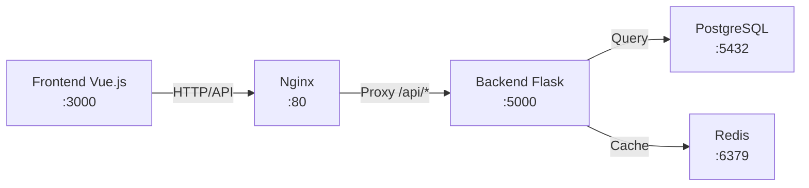

# Frontend-Backend Connection Architecture

## 🔗 Да, они полностью связаны!

### 1. **Прямая связь через API**
```
Frontend (Vue.js) --> API calls --> Backend (Flask)
   localhost:3000                    localhost:5000
```

### 2. **Архитектура связи**



### 3. **Конфигурация связи**

#### Frontend настройки:
```javascript
// frontend/src/services/api.js
const api = axios.create({
  baseURL: import.meta.env.VITE_API_URL || '/api/v1',
  // При разработке: http://localhost:5000/api/v1
  // В production: /api/v1 (через Nginx)
})
```

#### Docker Compose связывает всё вместе:
```yaml
services:
  backend:
    ports:
      - "5000:5000"
    networks:
      - blog_network
      
  frontend:
    build:
      args:
        VITE_API_URL: http://localhost:5000/api/v1
    depends_on:
      - backend
    networks:
      - blog_network
      
  nginx:
    # Проксирует /api/* на backend:5000
    depends_on:
      - backend
      - frontend
```

### 4. **Nginx проксирование**
```nginx
# Все API запросы идут на Backend
location /api {
    proxy_pass http://backend;
}

# Frontend статика
location / {
    root /var/www/frontend;
    try_files $uri /index.html;
}
```

### 5. **Как работает связь**

1. **Frontend делает запрос:**
   ```javascript
   await api.post('/auth/login', { username, password })
   // Отправляется на: /api/v1/auth/login
   ```

2. **Nginx перехватывает и проксирует:**
   ```
   /api/v1/auth/login → backend:5000/api/v1/auth/login
   ```

3. **Backend обрабатывает и отвечает:**
   ```python
   @bp.route('/login', methods=['POST'])
   def login():
       return jsonify({
           'user': user_data,
           'access_token': token
       })
   ```

4. **Frontend получает ответ:**
   ```javascript
   const { user, access_token } = response.data
   ```

### 6. **Аутентификация через JWT**
- Frontend сохраняет токен в localStorage
- Добавляет токен в заголовки всех запросов
- Backend проверяет токен через Flask-JWT-Extended

### 7. **Общие данные**

| Сущность | Frontend | Backend |
|----------|----------|---------|
| Пользователи | `stores/auth.js` | `models.User` |
| Посты | `services/posts.js` | `models.Post` |
| Категории | `services/categories.js` | `models.Category` |
| Комментарии | Компоненты | `models.Comment` |
| Лайки/Закладки | Интерактивные кнопки | `models.Like/Bookmark` |

### 8. **Синхронизация состояния**
- Frontend использует Pinia для state management
- Backend хранит данные в PostgreSQL
- Синхронизация через REST API

### 9. **Real-time функции (будущее)**
- WebSocket для уведомлений
- Server-Sent Events для обновлений
- Socket.IO для чата

## ✅ Проверка связи

### Запустить всё вместе:
```bash
# Вариант 1: Docker Compose (рекомендуется)
make build
make up

# Вариант 2: Раздельно для разработки
# Terminal 1 - Backend
cd backend
flask run

# Terminal 2 - Frontend
cd frontend
npm run dev
```

### Проверить работу:
1. Откройте http://localhost (Frontend через Nginx)
2. Или http://localhost:3000 (Frontend напрямую)
3. API доступно на http://localhost:5000/api/v1

## 🎯 Итог

**ДА, Frontend и Backend полностью связаны:**
- ✅ Общаются через REST API
- ✅ Используют JWT для аутентификации
- ✅ Nginx проксирует запросы
- ✅ Docker Compose объединяет всё
- ✅ Данные синхронизируются через API

Система готова к запуску как единое целое! 🚀