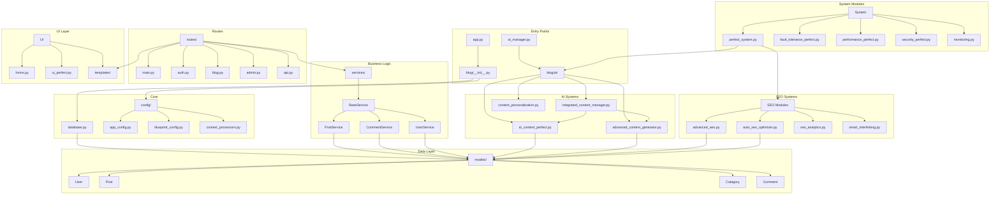

# 🏗️ АРХИТЕКТУРА МОДУЛЕЙ СИСТЕМЫ БЛОГА

## 📋 Содержание
1. [Обзор архитектуры](#обзор-архитектуры)
2. [Основные модули](#основные-модули)
3. [Модули данных (Models)](#модули-данных-models)
4. [Сервисный слой (Services)](#сервисный-слой-services)
5. [Маршруты (Routes)](#маршруты-routes)
6. [AI и контент-генерация](#ai-и-контент-генерация)
7. [SEO модули](#seo-модули)
8. [Системные модули](#системные-модули)
9. [Конфигурация](#конфигурация)
10. [Схема взаимосвязей](#схема-взаимосвязей)

---

## 🎯 Обзор архитектуры

Проект построен по модульной архитектуре с четким разделением ответственности:

```
┌─────────────────────────────────────────────────────────┐
│                    Frontend (Templates)                  │
├─────────────────────────────────────────────────────────┤
│                    Routes (Controllers)                  │
├─────────────────────────────────────────────────────────┤
│                    Services (Business Logic)             │
├─────────────────────────────────────────────────────────┤
│                    Models (Data Layer)                   │
├─────────────────────────────────────────────────────────┤
│                    Database (SQLAlchemy)                 │
└─────────────────────────────────────────────────────────┘
```

---

## 📦 Основные модули

### 1. **blog/__init__.py**
**Назначение:** Инициализация Flask приложения
**Функции:**
- Импортирует базу данных из `database.py`
- Инициализирует Flask расширения (login_manager, migrate, admin)
- Создает фабрику приложений через `create_app()`

**Зависимости:**
- `blog.database` → для объекта db
- `blog.config` → для конфигурации приложения

### 2. **blog/database.py** ⭐ НОВЫЙ
**Назначение:** Изолированная инициализация базы данных
**Функции:**
- Создает глобальный объект `db` (SQLAlchemy)
- `init_db(app)` - инициализирует БД с приложением
- `create_all_tables()` - создает все таблицы
- `drop_all_tables()` - удаляет все таблицы

**Используется везде:** Все модели и сервисы импортируют `db` отсюда

---

## 🗃️ Модули данных (Models)

### Структура моделей:
```
blog/models/
├── __init__.py          # Экспорт всех моделей
├── user.py             # Модель пользователя
├── post.py             # Модель поста
├── category.py         # Модель категории
├── comment.py          # Модель комментария
├── tag.py              # Модель тега
├── view.py             # Модель просмотра
├── bookmark.py         # Модель закладки
├── notification.py     # Модель уведомления
├── session.py          # Модель сессии пользователя
├── like.py             # Модели лайков (PostLike, CommentLike)
└── associations.py     # Связующие таблицы (post_tags)
```

### Основные модели:

#### **User** (blog/models/user.py)
**Поля:**
- Основные: id, username, email, password_hash
- Профиль: first_name, last_name, bio, avatar
- Настройки: is_admin, is_active, is_verified
- Статистика: login_count, posts_count, reputation_score

**Связи:**
- `posts` → один-ко-многим с Post
- `comments` → один-ко-многим с Comment
- `bookmarks` → один-ко-многим с Bookmark
- `notifications` → один-ко-многим с Notification

#### **Post** (blog/models/post.py)
**Поля:**
- Основные: id, title, slug, content, excerpt
- SEO: meta_title, meta_description, meta_keywords
- Статистика: views_count, likes_count, comments_count
- Статус: is_published, is_featured, is_pinned

**Связи:**
- `author` → много-к-одному с User
- `category` → много-к-одному с Category
- `tags` → многие-ко-многим с Tag
- `comments` → один-ко-многим с Comment
- `views` → один-ко-многим с View

#### **Category** (blog/models/category.py)
**Поля:**
- id, name, slug, description, color
- parent_id (для вложенных категорий)
- posts_count, is_active

**Связи:**
- `posts` → один-ко-многим с Post
- `parent/children` → самоссылка для иерархии

### Вспомогательная модель:

#### **models_perfect.py**
**Назначение:** Расширенные модели с дополнительной функциональностью
- SecurityLog - логирование безопасности
- SystemMetrics - системные метрики
- AIContent - AI сгенерированный контент
- SEOMetadata - SEO метаданные

---

## 🔧 Сервисный слой (Services)

### Структура:
```
blog/services/
├── __init__.py         # Экспорт сервисов
├── base.py            # Базовый класс BaseService
├── post_service.py    # Сервис постов
├── comment_service.py # Сервис комментариев
└── user_service.py    # Сервис пользователей
```

### **BaseService** (blog/services/base.py) ⭐ НОВЫЙ
**Назначение:** Базовый класс для всех сервисов (паттерн Repository)
**Методы:**
- `get_by_id(id)` - получить по ID
- `get_all()` - получить все записи
- `get_paginated()` - с пагинацией
- `create(**kwargs)` - создать запись
- `update(id, **kwargs)` - обновить
- `delete(id)` - удалить
- `bulk_create()` - массовое создание
- `count()` - подсчет записей

### **PostService** (blog/services/post_service.py)
**Наследует:** BaseService
**Специальные методы:**
- `get_published_posts()` - опубликованные посты
- `get_posts_by_category()` - посты по категории
- `search_posts()` - поиск постов
- `get_popular_posts()` - популярные посты
- `publish_post()` - публикация поста

### **CommentService** (blog/services/comment_service.py) ⭐ НОВЫЙ
**Наследует:** BaseService
**Специальные методы:**
- `get_post_comments()` - комментарии к посту
- `create_comment()` - создание с уведомлениями
- `approve_comment()` - одобрение
- `get_comment_tree()` - древовидная структура

### **UserService** (blog/services/user_service.py) ⭐ НОВЫЙ
**Наследует:** BaseService
**Специальные методы:**
- `create_user()` - создание с хешированием пароля
- `authenticate()` - аутентификация
- `change_password()` - смена пароля
- `request_password_reset()` - сброс пароля
- `get_user_statistics()` - статистика пользователя

---

## 🌐 Маршруты (Routes)

### Структура:
```
blog/routes/
├── main.py         # Главные страницы
├── auth.py         # Аутентификация
├── blog.py         # Блог функциональность
├── admin.py        # Админ-панель
├── ai_admin.py     # AI управление
├── system_admin.py # Системное администрирование
├── seo.py          # SEO инструменты
└── api.py          # REST API
```

### **main.py**
**Маршруты:**
- `/` - главная страница
- `/about` - о проекте
- `/contact` - контакты
- `/search` - поиск

**Использует:** PostService, модели

### **auth.py**
**Маршруты:**
- `/auth/login` - вход
- `/auth/register` - регистрация
- `/auth/logout` - выход
- `/auth/profile` - профиль

**Использует:** UserService, Flask-Login

### **blog.py**
**Маршруты:**
- `/blog/` - список постов
- `/blog/post/<slug>` - детали поста
- `/blog/create` - создание поста
- `/blog/category/<slug>` - посты категории

**Использует:** PostService, CommentService

### **admin.py** (имя blueprint: 'blog_admin')
**Маршруты:**
- `/admin/` - панель управления
- `/admin/posts` - управление постами
- `/admin/users` - управление пользователями
- `/admin/comments` - модерация комментариев

**Использует:** Все сервисы, декоратор @admin_required

### **ai_admin.py**
**Маршруты:**
- `/ai/dashboard` - AI панель
- `/ai/generate` - генерация контента
- `/ai/settings` - настройки AI

**Использует:** AIContentGenerator, ContentScheduler

### **api.py**
**REST API маршруты:**
- `/api/posts` - CRUD для постов
- `/api/categories` - CRUD для категорий
- `/api/users` - информация о пользователях
- `/api/stats` - статистика

**Использует:** Сервисы, JSON responses

---

## 🤖 AI и контент-генерация

### **ai_content_perfect.py**
**Назначение:** Совершенная генерация AI контента
**Классы:**
- `PerfectAIContentGenerator` - основной генератор
- `ContentScheduler` - планировщик публикаций
- `AIContentOptimizer` - оптимизатор контента

**Функции:**
- `generate_human_like_post()` - генерация поста
- `populate_blog_with_ai_content()` - массовое наполнение
- `start_ai_content_generation()` - запуск автогенерации

### **advanced_content_generator.py**
**Назначение:** Продвинутая генерация с персонализацией
**Классы:**
- `AdvancedContentGenerator` - генератор с ML
- `ContentRequest` - запрос на генерацию
- `GeneratedContent` - результат генерации

**Особенности:**
- Поддержка разных типов контента
- Персонализация под аудиторию
- SEO оптимизация

### **integrated_content_manager.py**
**Назначение:** Интеграция всех AI систем
**Функции:**
- Объединяет генерацию, валидацию, SEO
- Управляет workflow контента
- Мониторинг качества

### **content_personalization.py**
**Назначение:** Персонализация контента
**Классы:**
- `ContentPersonalizer` - персонализатор
- `UserBehaviorAnalyzer` - анализ поведения
- `PersonalizedContentGenerator` - генератор

**Функции:**
- Анализ предпочтений пользователя
- Рекомендации контента
- Адаптация стиля

### **bias_mitigation.py**
**Назначение:** Устранение предвзятости в AI
**Функции:**
- Детекция предвзятости
- Корректировка контента
- Обеспечение нейтральности

### **error_detection.py**
**Назначение:** Обнаружение ошибок в тексте
**Классы:**
- `RussianSpellChecker` - проверка орфографии
- `GrammarChecker` - проверка грамматики
- `StyleChecker` - проверка стиля

### **blog/ai/__init__.py** ⭐ НОВЫЙ
**Назначение:** Совместимость с ai_manager.py
**Функции:**
- Создает алиасы для существующих AI модулей
- Обеспечивает обратную совместимость
- Заглушки для отсутствующих функций

---

## 🔍 SEO модули

### **advanced_seo.py**
**Назначение:** Продвинутая SEO оптимизация
**Классы:**
- `AdvancedSEOOptimizer` - главный оптимизатор
- `MetaTagGenerator` - генератор мета-тегов
- `StructuredDataGenerator` - Schema.org разметка
- `ContentSEOAnalyzer` - анализ контента

**Функции:**
- Автоматическая генерация мета-тегов
- Создание structured data
- Анализ SEO показателей

### **auto_seo_optimizer.py**
**Назначение:** Автоматическая SEO оптимизация
**Классы:**
- `AutoSEOOptimizer` - автооптимизатор

**Функции:**
- `update_sitemap()` - обновление sitemap.xml
- `update_robots_txt()` - обновление robots.txt
- `optimize_post_seo()` - оптимизация поста

### **seo_analytics.py**
**Назначение:** SEO аналитика
**Классы:**
- `SEOAnalytics` - аналитика
- `KeywordTracker` - трекинг ключевых слов
- `RankingMonitor` - мониторинг позиций

**Функции:**
- Анализ эффективности SEO
- Отслеживание позиций
- Рекомендации по улучшению

### **smart_interlinking.py**
**Назначение:** Умная перелинковка
**Классы:**
- `SmartInterlinkingSystem` - система перелинковки

**Функции:**
- Автоматическое создание внутренних ссылок
- Анализ связности контента
- Оптимизация link juice

---

## ⚙️ Системные модули

### **perfect_system.py**
**Назначение:** Интеграция всех "perfect" модулей
**Функции:**
- Импортирует все perfect модули
- Создает единую точку доступа
- Координирует работу систем

### **fault_tolerance_perfect.py**
**Назначение:** Отказоустойчивость
**Классы:**
- `PerfectFaultToleranceSystem` - главная система
- `CircuitBreaker` - автоматический выключатель
- `RetryMechanism` - механизм повторов
- `HealthChecker` - проверка здоровья

**Функции:**
- Автоматическое восстановление
- Мониторинг состояния
- Graceful degradation

### **performance_perfect.py**
**Назначение:** Оптимизация производительности
**Классы:**
- `PerformanceOptimizer` - оптимизатор
- `CacheManager` - управление кешем
- `QueryOptimizer` - оптимизация запросов
- `ResourceMonitor` - мониторинг ресурсов

**Функции:**
- Кеширование (Redis/Memcached)
- Оптимизация запросов к БД
- Профилирование производительности

### **security_perfect.py**
**Назначение:** Безопасность
**Классы:**
- `SecurityManager` - менеджер безопасности
- `RateLimiter` - ограничение запросов
- `InputValidator` - валидация входных данных
- `SessionManager` - управление сессиями

**Функции:**
- XSS/CSRF защита
- Rate limiting
- Шифрование данных
- Аудит безопасности

### **monitoring.py**
**Назначение:** Мониторинг системы
**Классы:**
- `MonitoringSystem` - система мониторинга

**Функции:**
- Сбор метрик
- Логирование событий
- Алерты при проблемах
- Интеграция с Prometheus

### **api_perfect.py**
**Назначение:** REST API с расширенными возможностями
**Классы:**
- `PerfectAPIManager` - менеджер API
- `APIRateLimiter` - лимитирование
- `APIAuthenticator` - аутентификация
- `APIVersionManager` - версионирование

**Функции:**
- RESTful endpoints
- GraphQL поддержка
- WebSocket для real-time
- API документация

### **ui_perfect.py**
**Назначение:** Совершенный UI/UX
**Классы:**
- `PerfectUIManager` - менеджер UI
- `ThemeManager` - управление темами
- `AnimationManager` - анимации
- `AccessibilityManager` - доступность

**Функции:**
- Адаптивный дизайн
- PWA функциональность
- Темная/светлая тема
- A11y совместимость

---

## 📁 Конфигурация

### **blog/config/** ⭐ НОВАЯ СТРУКТУРА

#### **app_config.py**
**Назначение:** Конфигурация приложения
**Класс:** `AppConfig`
**Функции:**
- `create_app()` - создание Flask app
- Настройка БД, безопасности
- Инициализация расширений

#### **blueprint_config.py**
**Назначение:** Регистрация Blueprint'ов
**Класс:** `BlueprintConfig`
**Функции:**
- `register_blueprints()` - регистрация всех routes

#### **context_processors.py** ⭐ НОВЫЙ
**Назначение:** Контекстные процессоры для шаблонов
**Функции:**
- `inject_categories()` - категории во все шаблоны
- `inject_seo_meta()` - SEO мета-теги
- `inject_user_data()` - данные пользователя
- `inject_site_config()` - конфигурация сайта

---

## 🔗 Схема взаимосвязей



---

## 🔄 Основные потоки данных

### 1. **Создание поста**
```
User → Route (blog.py) → PostService → Post Model → Database
                      ↓
                  SEO Optimizer → Meta Tags
                      ↓
                  Notification Service → Users
```

### 2. **AI генерация контента**
```
ai_manager.py → AIContentGenerator → AI Provider (OpenAI/Claude)
                                  ↓
                            Content Validator
                                  ↓
                            SEO Optimizer
                                  ↓
                            PostService → Database
```

### 3. **Поиск и персонализация**
```
User Search → SearchService → ElasticSearch/DB
                           ↓
                    PersonalizationEngine
                           ↓
                    Ranked Results → UI
```

### 4. **Мониторинг и безопасность**
```
All Requests → SecurityMiddleware → RateLimiter
                                 ↓
                           Route Handler
                                 ↓
                        MonitoringSystem → Metrics
                                        ↓
                                   Prometheus
```

---

## 📚 Ключевые паттерны

1. **Repository Pattern** - в сервисном слое (BaseService)
2. **Factory Pattern** - create_app() в конфигурации
3. **Singleton Pattern** - в системных модулях
4. **Observer Pattern** - в мониторинге и уведомлениях
5. **Strategy Pattern** - в AI провайдерах
6. **Circuit Breaker** - в fault tolerance

---

## 🚀 Рекомендации по использованию

1. **Для новых функций:**
   - Создавайте сервис, наследуя BaseService
   - Добавляйте route в соответствующий blueprint
   - Используйте существующие модели или расширяйте их

2. **Для AI функций:**
   - Используйте integrated_content_manager для координации
   - Добавляйте валидацию через error_detection
   - Применяйте bias_mitigation для нейтральности

3. **Для оптимизации:**
   - Используйте performance_perfect для кеширования
   - Применяйте monitoring для отслеживания
   - Внедряйте fault_tolerance для устойчивости

---

*Документация создана: 4 октября 2025*
*Версия архитектуры: 2.0*